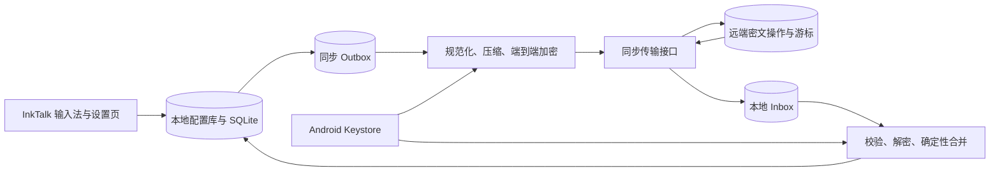

# InkTalk 配置与数据同步设计方案

## 结论

建议采用「本地优先、分层同步、端到端加密、增量合并」的方案：

1. InkTalk 在离线状态下仍以本地数据为准，输入法主流程不依赖云端可用性。
2. 配置分为可跨设备配置、设备本地配置、敏感凭据和运行时状态，四类数据采用不同策略。
3. 输入记录、整理结果、热词操作和候选状态以实体或操作为单位增量同步，不上传整个 SQLite 文件，也不使用整包覆盖。
4. 同步服务只保存密文和最少的路由元数据。服务端不持有 ASR、AI 凭据和输入正文的解密能力。
5. 默认仅同步普通配置和热词。输入历史需要用户主动开启；API 密钥默认只留在本机。
6. 第一阶段先修复本地配置与密钥边界，第二阶段实现可验证的加密备份，第三阶段再接入自动多设备同步。

这套设计适合 InkTalk 当前的 Android 单端、无账号、可侧载形态。它不要求先建设完整账号系统，也为以后增加账号登录或其他同步后端保留接口。

## 1. 现状与问题

### 1.1 当前存储

| 数据 | 当前载体 | 当前行为 | 主要问题 |
| --- | --- | --- | --- |
| ASR 和 AI 凭据 | `inktalk_prefs` | 与普通配置一起写入 `SharedPreferences` | 凭据与普通偏好没有安全边界 |
| ASR、AI、输入模式、布局配置 | `inktalk_prefs` | 本机读取和即时生效 | 缺少字段版本、变更时间和跨设备合并语义 |
| 热词和优先热词 | `inktalk_prefs` | 字符串列表，保存时去重 | 跨设备并发增删和排序难以合并 |
| 输入记录 | `input_history.db/input_entries` | 只追加 | 适合增量同步，但本地自增 `id` 不能作为跨设备标识 |
| 每日整理 | `daily_organizations` | 每次整理保留一个版本 | 可同步为不可变版本，但需要全局 ID 和来源引用 |
| 热词选择、候选和编辑事件 | SQLite 多表 | 部分只追加，候选状态可更新 | 缺少全局 ID、删除标记和冲突规则 |
| 更新下载状态 | 独立 `SharedPreferences` | 本机使用 | 不应跨设备同步 |

当前应用设置了 `android:allowBackup="false"`，系统不会自动备份应用数据。现有「导入与导出」只处理部分配置：导出文件包含 ASR 和 AI 凭据，未包含输入历史；`asr_install_uid` 不导出。导入使用整批写入，但没有同步游标、冲突解决或回滚快照。

### 1.2 不建议直接复用现有 JSON 作为自动同步协议

现有配置 JSON 适合人工迁移，不适合作为自动同步协议，原因如下：

- 它是某一时刻的完整快照，无法区分两个设备各自新增的变更。
- 它包含明文 API 密钥，进入网盘、聊天软件或日志后可能泄露。
- 它没有每个字段的更新时间、来源设备和删除语义。
- 导入会把出现的字段直接覆盖到本地，无法安全处理并发修改。
- 它没有输入历史、整理版本、候选状态和引用关系。

因此，人工备份格式和自动同步协议应分开设计，但可以共用同一组规范化数据模型、验证器和加密模块。

## 2. 目标与非目标

### 2.1 目标

- 离线可用。同步失败不能阻塞语音、手写、全键盘、AI 指令和历史查看。
- 用户可选择同步范围，并能看见最近同步结果和失败原因。
- 两台设备离线修改后重新联网，能够确定性合并，避免整库覆盖。
- 输入正文和凭据在传输前于本机加密。
- 同步协议可升级，旧客户端遇到未知字段时不破坏已知数据。
- 支持设备移除、同步空间重置、远端数据删除和本地数据保留选择。
- 同步过程可测试、可观测、可重试，并且不记录凭据、明文正文或完整热词。

### 2.2 非目标

- 第一版不提供多人协作、共享词库或团队权限。
- 第一版不要求 Web 控制台查看输入内容。
- 同步服务不代替 ASR 或 AI 服务，不代理用户的模型请求。
- 不承诺实时同步。输入法场景优先保证本地延迟和稳定性。
- 不把宿主 App 的编辑框全文、临时指令上下文、原始音频或 ASR 中间结果纳入同步。

## 3. 数据分层与默认策略

### 3.1 四类配置

| 类别 | 代表字段 | 推荐默认策略 | 合并方式 |
| --- | --- | --- | --- |
| 可跨设备普通配置 | `asr_resource_id`、`asr_enable_ddc`、`asr_enable_punc`、`asr_enable_itn`、`speech_input_mode`、`english_recognition_strategy`、`ai_base_url`、`ai_model`、`ai_no_thinking`、`ai_replace_original` | 同步 | 每字段按版本合并 |
| 设备本地配置 | `wide_ime_content_on_right`、`extreme_height_mode`、`enable_full_keyboard` | 默认不同步 | 仅本机保存；以后可允许用户逐项改为跟随账户 |
| 敏感凭据 | `asr_api_key`、`asr_app_key`、`asr_access_key`、`ai_api_key` | 默认不同步 | Android Keystore 保护；用户明确开启后才进入端到端加密密钥包 |
| 运行时和内部状态 | `asr_install_uid`、热词默认版本、更新下载状态、权限状态、同步游标 | 不同步为用户配置 | 每台设备独立维护 |

`enable_full_keyboard` 和 `extreme_height_mode` 是否应跨设备属于产品选择。本方案把它们默认为设备本地配置，因为不同设备的屏幕尺寸、折叠形态和使用姿势可能不同。若用户希望统一，可在后续设置页提供「此项跟随同步」开关。

### 3.2 用户数据

| 数据类型 | 推荐默认策略 | 同步模型 | 备注 |
| --- | --- | --- | --- |
| 用户热词 | 同步 | 每个规范化词条一个实体 | 保留显示文本、优先级、顺序和删除标记 |
| 手工热词选择记录 | 默认不同步 | 可选只追加事件 | 主要用于证据回溯，不影响热词本身可用性 |
| 输入记录 | 默认关闭，用户主动开启 | 不可变实体 | 内容高度敏感；每条记录独立加密 |
| 每日整理 | 跟随输入历史 | 不可变版本 | 不覆盖旧版本 |
| 热词候选 | 跟随输入历史 | 实体加状态 | 候选内容依赖输入历史证据 |
| 编辑事件 | 默认关闭 | 可选只追加事件 | 仅同步生成热词候选所需的最小字段 |

建议提供三个同步范围，避免让用户逐表理解：

- 「配置与热词」：默认推荐，不含输入正文和凭据。
- 「完整数据」：增加输入记录、每日整理、候选和必要编辑事件。
- 「自定义」：高级用户逐项选择；凭据始终需要单独确认。

## 4. 推荐架构



### 4.1 Android 客户端模块

建议增加以下边界，而不是继续让界面和业务代码直接操作任意 `SharedPreferences` 字段：

| 模块 | 职责 |
| --- | --- |
| `SettingsRepository` | 读取和更新类型化配置；区分 roaming、device-local、secret、internal |
| `CredentialStore` | 使用 Android Keystore 包装的本地密钥加密凭据；不向 UI 回填明文 |
| `SyncDatabase` | 保存设备身份、同步游标、Outbox、Inbox、实体版本和墓碑 |
| `SyncChangeRecorder` | 与本地业务写入同一事务记录待同步变更 |
| `SyncEngine` | push、pull、退避、批次控制、合并和状态上报 |
| `SyncCrypto` | 派生数据密钥、按记录加密、认证附加数据和密钥轮换 |
| `SyncTransport` | 抽象网络接口；业务层不依赖具体云服务 |
| `SyncCoordinator` | 在设置页手动触发，并通过系统后台任务进行条件同步 |

`InputMethodService` 只读取已经落地的本地配置和数据，不等待网络同步。远端变更先进入 Inbox，经完整验证和事务合并后再对本地可见。

### 4.2 远端同步服务

远端服务只需要提供以下能力：

- 创建同步空间并签发一次性设备配对令牌。
- 注册、列出和撤销设备。
- 追加幂等的密文变更批次。
- 按单调游标拉取变更。
- 保存压缩快照，便于新设备首次恢复和服务端清理旧操作。
- 删除同步空间及其全部密文。
- 执行配额、批次大小和请求频率限制。

服务端不解析业务 payload，也不参与配置字段或输入记录的冲突判断。这样可以把同步后端实现为自建服务、对象存储加轻量 API，或未来的其他适配器，而不改变 Android 端的业务合并逻辑。

## 5. 身份、配对与端到端加密

### 5.1 无账号同步空间

第一版建议采用「同步空间」而不是强制账号登录：

1. 第一台设备生成随机 `space_id`、同步访问密钥和端到端加密根密钥。
2. 服务端只保存访问密钥的不可逆校验值，不保存端到端加密根密钥。
3. 第一台设备创建短时、单次使用的配对二维码。
4. 第二台设备扫码后，通过 TLS 领取同步空间权限，并在设备间转移根密钥。
5. 两台设备各自生成稳定的随机 `device_id`。它只标识一次安装，不使用 Android 硬件标识。
6. 用户可以另行导出恢复包。恢复包包含重新加入同步空间所需材料，必须再次用恢复密码加密。

以后若增加账号系统，可把同步空间绑定到账号，但不改变数据加密和合并协议。

### 5.2 密钥分层

| 密钥 | 保存位置 | 用途 |
| --- | --- | --- |
| 设备包装密钥 | Android Keystore | 加密本机保存的根密钥和凭据 |
| 同步根密钥 | 设备本地密文；配对时安全转移 | 派生不同数据域的密钥 |
| 数据域密钥 | 运行时派生 | 分别加密配置、热词、历史和凭据 |
| 传输访问密钥 | 设备本地密文；服务端只存校验值 | 鉴权同步 API，不用于解密正文 |

每条同步记录应使用独立随机 nonce，并采用带认证的加密算法。认证附加数据至少包含 `space_id`、`entity_type`、`entity_id`、`schema_version` 和 `operation_id`，防止密文被跨空间或跨类型替换。

### 5.3 凭据规则

- 默认不上传 ASR 和 AI API 密钥。
- UI 只显示「已配置」和末尾少量字符，不从存储层取出完整密钥回填到输入框。
- 同一服务地址未变化且密钥输入留空时，保留原凭据；显式「移除密钥」才删除。
- 用户开启「同步服务凭据」时，凭据进入单独数据域；新设备恢复后仍应要求用户执行 ASR 和 AI 连接测试。
- 日志、崩溃报告、同步错误和服务端元数据不得包含明文凭据。

## 6. 同步数据协议

### 6.1 通用变更信封

建议业务 payload 加密前使用以下逻辑结构：

```json
{
  "protocol_version": 1,
  "operation_id": "uuid",
  "space_id": "uuid",
  "device_id": "uuid",
  "entity_type": "input_entry",
  "entity_id": "uuid",
  "entity_schema_version": 1,
  "operation": "upsert",
  "hlc": "physical-logical-device",
  "created_at": 0,
  "payload": {},
  "content_hash": "sha256"
}
```

`created_at: 0` 只表示结构中的字段类型，不是建议默认时间。实际写入必须使用产生事件时的时间戳。服务端接收时间只用于运维和游标，不替代客户端业务时间。

跨设备 ID 必须使用 UUID 等全局标识。现有 SQLite 自增 `id` 继续作为本地查询键，但不能上传为唯一实体标识。引用关系应改用 `sync_id`，例如每日整理引用输入记录的 `sync_id` 或输入快照边界。

### 6.2 本地同步表

建议至少增加：

```text
sync_devices(device_id, display_name, created_at, revoked_at)
sync_state(space_id, pull_cursor, last_success_at, last_error_code)
sync_outbox(operation_id, entity_type, entity_id, payload, state, retry_count, created_at)
sync_inbox(remote_cursor, operation_id, ciphertext, state, received_at)
sync_entity_versions(entity_type, entity_id, hlc, content_hash, deleted_at)
```

业务变更与 Outbox 必须在同一数据库事务内提交。若普通配置暂时仍在 `SharedPreferences`，应先写入类型化配置存储，再记录 Outbox；长期建议把可同步配置迁移到具有事务能力的表中，`SharedPreferences` 仅保留启动所需缓存或设备本地值。

### 6.3 Push 与 Pull

#### Push

1. 从 Outbox 读取有限批次的待发送操作。
2. 规范化 payload，计算内容哈希并加密。
3. 使用 `operation_id` 作为幂等键上传。
4. 服务端确认持久化后标记已发送。
5. 未确认的操作保留并按退避策略重试。

#### Pull

1. 使用本地 `pull_cursor` 拉取下一批密文操作。
2. 先持久化到 Inbox，再更新网络接收状态。
3. 校验信封、版本、密文认证和内容哈希。
4. 按实体类型执行确定性合并。
5. 在同一事务中写入业务数据、实体版本和新游标。
6. 合并失败时保留 Inbox，不推进对应游标，并向用户显示可恢复错误。

客户端不能仅凭 HTTP 成功就删除本地变更。必须以服务端确认该 `operation_id` 已持久化为准。

## 7. 冲突解决规则

### 7.1 普通配置：按字段合并

不要把全部配置作为一个对象执行最后写入者获胜。应为每个字段记录独立版本：

```text
setting_key + value + hlc + changed_by_device
```

同一字段发生冲突时，比较混合逻辑时钟；完全相同则使用 `device_id` 作为稳定排序因子。导入前仍需执行字段类型、枚举值、URL 和长度校验。未知字段保留在同步层，但旧客户端不应用它。

### 7.2 热词：词条实体合并

热词不再同步整段换行文本。每个词条使用规范化键作为身份的一部分：

```text
hotword_id, normalized_term, display_term, priority, position, updated_hlc, deleted_hlc
```

- 两台设备新增不同词条：并集。
- 两台设备新增同一规范化词条：合并为一个词条，保留较新的显示文本和优先级。
- 删除与更新冲突：比较对应 HLC；较新的操作生效。
- 调整顺序：同步稳定的 `position`，不要依赖本地数组下标。
- 被删除词条保留墓碑一段时间，防止离线旧设备重新上传后复活。墓碑保留时长属于部署参数，需在实施前确认。

本地仍可在请求 ASR 前序列化为现有热词字符串，以减少对 `AsrRequestPayload` 的改动。

### 7.3 输入记录和编辑事件：不可变并集

`input_entries` 和可同步的 `edit_events` 使用全局 `sync_id`，上传后不可修改。相同 `sync_id` 且内容哈希一致时去重；哈希不一致表示数据损坏或实现错误，必须停止应用该实体并记录安全错误，不能静默选择一份。

### 7.4 每日整理：保留版本

每日整理本来就是多版本模型，跨设备同步时继续保留：

- 每次生成新 `organization_id`。
- 保存生成设备、生成时间、输入记录边界和内容。
- 展示时默认选择最新的有效版本，但允许查看其他版本。
- 不使用一台设备的结果覆盖另一台设备的独立整理结果。

### 7.5 候选状态：用户决策优先

候选内容和用户决策分开：候选证据可以合并，`pending`、`added`、`dismissed` 作为决策事件同步。多个设备作出不同决策时，以较新的用户决策为准，并保留决策来源用于排错。加入热词和更新候选状态应在同一事务中完成。

## 8. 删除、重置与保留

需要区分四个动作：

| 用户动作 | 本地数据 | 远端数据 | 其他设备 |
| --- | --- | --- | --- |
| 关闭同步 | 保留 | 保留 | 继续保留 |
| 移除此设备 | 可由用户选择保留或清除 | 撤销该设备凭据 | 不受影响 |
| 清空某类同步数据 | 写入范围墓碑或删除事件 | 按协议删除 | 下次同步后删除 |
| 删除同步空间 | 可由用户选择保留或清除 | 删除全部密文和设备授权 | 全部设备失去访问 |

大范围清空必须使用独立的「范围删除纪元」，不能通过上传空快照实现。旧设备若携带早于删除纪元的数据，服务端或客户端应拒绝其重新复活。

具体的远端保留期、墓碑保留期和备份清理周期需要在选定后端后确认，并写入隐私说明。

## 9. 调度、性能与流量

- 本地写入后立即记录 Outbox，但不要在每次按键或每个 ASR 中间结果上发网络请求。
- 普通配置和热词可使用短时间合并窗口，将连续修改压成同一字段或词条的最新操作。
- 输入记录仅在最终提交并写入 `input_entries` 后进入 Outbox。
- 后台同步应要求网络可用；大批历史首次上传可默认等待非计费网络和充电状态，并允许用户手动覆盖。
- 设置页的「立即同步」应显示 push、pull、合并三个阶段，而不是只显示旋转进度。
- 服务端和客户端都要限制单批记录数、单条密文大小和总解密大小，防止异常文件或远端数据耗尽内存。
- 新设备首次恢复优先下载加密快照，再拉取快照游标之后的增量操作。

同步不能运行在输入法 UI 主线程。同步完成后，热词和配置通过仓库层通知业务刷新；进行中的 ASR 会话继续使用启动时冻结的配置，下一个会话再读取新配置，避免会话中途改变协议参数。

## 10. 设置页与状态设计

建议在现有「导入与导出」附近增加「同步」入口。

### 10.1 同步首页

- 状态：未启用、同步中、已同步、需要处理、已暂停。
- 最近成功同步时间。
- 当前同步范围。
- 设备列表和撤销入口。
- 「立即同步」「更改同步范围」「导出恢复包」「关闭同步」。

### 10.2 首次启用

1. 选择「创建同步空间」或「加入已有同步空间」。
2. 选择同步范围。
3. 明确提示输入历史的敏感性。
4. 创建恢复包或确认稍后创建。
5. 执行首次同步并显示上传、下载、合并数量。

### 10.3 失败文案分类

| 状态 | 面向用户的说明 | 恢复动作 |
| --- | --- | --- |
| 网络不可用 | 当前无法连接同步服务，本地功能不受影响 | 等待网络或立即重试 |
| 设备授权失效 | 此设备已被移除或同步凭据失效 | 重新配对 |
| 恢复密钥错误 | 无法解密同步数据 | 重新扫码或导入正确恢复包 |
| 数据版本过新 | 当前 InkTalk 版本无法安全读取部分数据 | 更新应用，不推进游标 |
| 本地存储失败 | 数据已下载，但未能写入本机 | 释放空间后重试 |
| 数据认证失败 | 同步数据未通过完整性验证 | 停止应用该批次并保留诊断编号 |

错误信息不得展示服务器响应中的凭据、密文正文或完整 URL 查询参数。

## 11. 人工导入与导出改造

自动同步落地前，现有手工迁移也应先改造：

1. 默认导出不含凭据，并在 UI 中明确列出包含范围。
2. 若用户选择包含凭据，要求设置导出密码，并使用认证加密生成备份包。
3. 配置导入先解析到草稿，展示将新增、覆盖和跳过的项目，再由用户确认。
4. 导入前创建可恢复的本地快照；任一必需字段验证或写入失败时整体回滚。
5. 「导入配置」和「恢复完整备份」使用不同入口和文件类型。
6. 完整备份复用同步实体模型和版本迁移器，不直接复制正在使用的 SQLite 文件。
7. 导入凭据后必须分别执行 ASR 和 AI 连接测试；失败不代表其他普通配置需要回滚，但凭据不能标记为已验证。

## 12. 数据迁移

### 12.1 配置迁移

- 为每个现有设置声明类型、默认值、同步类别和验证器。
- 将普通配置迁移到类型化 `SettingsRepository`。
- 将四类凭据迁移到 `CredentialStore`，确认新存储可读后再删除旧明文值。
- 首次迁移保留迁移版本和完成标记，支持进程中断后幂等重试。
- 不把现有 `asr_install_uid` 当成同步 `device_id`；为同步另行生成 ID。

### 12.2 SQLite 迁移

在现有业务表中增加 `sync_id`，并为历史数据生成稳定的本机 UUID。建议同时增加必要的来源字段和索引：

```text
input_entries.sync_id UNIQUE NOT NULL
daily_organizations.sync_id UNIQUE NOT NULL
daily_organizations.source_device_id
hotword_selections.sync_id UNIQUE NOT NULL
hotword_candidates.sync_id UNIQUE NOT NULL
edit_events.sync_id UNIQUE NOT NULL
```

迁移期间不能用本地自增 ID 拼接设备名作为永久标识。UUID 应在迁移事务中生成并持久化；再次运行迁移不得变化。

### 12.3 首次上线保护

- 新版本首次启动只完成本地迁移，不自动开启同步。
- 启用同步前运行本地完整性检查并统计待上传实体数量。
- 首次上传完成后，从服务端读取并校验操作数量和内容哈希确认，不以「请求成功」替代持久化验证。
- 迁移失败时继续使用旧数据路径或进入只读恢复页，不能清空旧数据后重新开始。

## 13. 安全与隐私控制

- 输入历史属于高敏感数据，默认关闭同步并使用单独确认页。
- 应用日志只记录操作 ID 前缀、实体类型、数量、耗时、错误码和重试次数。
- 不记录明文正文、热词内容、模型提示词、API 密钥、恢复密钥和完整设备配对二维码。
- 配对二维码应短时有效且只能使用一次；截屏风险需要在界面中提示。
- 设备撤销后，该设备不能继续拉取或追加新操作；已下载到该设备的本地明文无法由服务端远程保证删除，需要在文案中明确。
- 密钥轮换采用新数据域密钥加密后续记录，并通过加密密钥清单让已授权设备读取旧记录；是否后台重加密历史数据在实施时评估。
- 发布前需要完成威胁建模，至少覆盖远端泄露、恶意同步数据、重放、回滚、配对码泄露、设备丢失和调试日志泄露。

## 14. 可观测性与诊断

本机维护以下非敏感指标：

- Outbox 待发送数量和最老操作年龄。
- 最近 push、pull、merge 的开始时间、完成时间和结果。
- 最近成功游标和批次 ID。
- 按实体类型统计上传、下载、合并、跳过和失败数量。
- 重试次数及标准化错误码。
- 快照版本、协议版本和本地数据库版本。

设置页提供「复制同步诊断」时，只输出上述元数据。诊断生成器必须经过测试，确保不会包含正文、热词、密钥、二维码内容或完整密文。

## 15. 测试与验收

### 15.1 单元测试

- 每个配置字段的类型、默认值、同步类别和验证规则。
- 旧 `SharedPreferences` 到新配置与凭据存储的幂等迁移。
- 变更信封序列化、版本兼容和未知字段处理。
- 每类实体的合并规则，包括相同时钟的稳定排序。
- 热词并发新增、删除、恢复、重排和墓碑阻止复活。
- Outbox 幂等上传和重复 Pull 去重。
- 密钥错误、密文篡改、内容哈希不一致和超限数据拒绝。
- 大范围删除纪元阻止旧设备恢复已清除数据。

### 15.2 数据库与恢复测试

- 从当前数据库版本迁移后，记录数、内容和引用关系保持一致。
- 迁移中断后可重试，`sync_id` 不变化。
- Push 成功但本地未标记、Pull 成功但合并中断等崩溃点可恢复。
- 完整备份导出、导入和回滚前后内容哈希一致。
- 新客户端写入旧客户端未知字段时，旧客户端不丢弃远端数据。

### 15.3 多设备情景测试

- A、B 离线修改不同配置，联网后合并。
- A、B 同时修改同一配置，结果确定且一致。
- A 新增热词、B 删除同一热词，按版本得出一致结果。
- 两台设备各自产生输入记录和每日整理，最终都保留。
- 设备长时间离线跨过墓碑或快照清理边界后重新加入。
- 撤销设备后旧凭据无法继续 push 或 pull。
- 删除同步空间后所有设备进入明确的失效状态。

### 15.4 真机验收边界

本地单元测试、数据库测试和 APK 构建只能证明代码与迁移逻辑。发布前还需要至少两台真实 Android 设备验证：

- 离线输入不受同步任务影响。
- 后台限制、进程终止、重启和网络切换后的同步恢复。
- 不同屏幕形态下设备本地布局配置不会被其他设备覆盖。
- 配对、恢复包、设备撤销和完整远端删除流程。
- ASR 和 AI 凭据迁移后的真实连接测试。

## 16. 分阶段实施建议

### 阶段 0：确定产品边界

需要确认：

- 是否接受无账号「同步空间 + 配对二维码」作为第一版身份模型。
- 第一版是否只做 Android 多设备。
- 输入历史是否默认关闭同步。
- 是否允许凭据进入端到端加密同步。
- 选择自建同步后端还是仅先交付加密备份。

退出条件：同步范围、身份模型、后端责任和隐私文案得到确认。

### 阶段 1：本地存储安全化

- 引入 `SettingsRepository` 和字段注册表。
- 引入 `CredentialStore`，迁移明文凭据。
- 改造设置页保存逻辑，不再回填完整密钥。
- 升级手工导出：默认排除凭据，支持加密完整备份。
- 为业务表添加稳定 `sync_id`。

退出条件：迁移和回滚测试通过；当前功能无回归；旧明文凭据已在成功迁移后删除。

### 阶段 2：本地同步内核

- 增加 Outbox、Inbox、实体版本、墓碑和合并器。
- 用内存或文件测试传输层完成双设备仿真。
- 完成冲突、重放、崩溃恢复和批次限制测试。

退出条件：无需真实后端即可重复运行多设备收敛测试，最终状态和内容哈希一致。

### 阶段 3：远端密文同步

- 实现同步空间、设备配对、push、pull、快照和撤销接口。
- 接入端到端加密和恢复包。
- 增加后台调度、设置页状态与非敏感诊断。

退出条件：测试环境服务通过权限、配额、幂等、并发和数据删除验证；服务端无法解密业务 payload。

### 阶段 4：真机试运行

- 两台以上真机执行离线并发、弱网、进程终止、撤销和恢复测试。
- 小范围用户试运行，观察失败类型、Outbox 堆积和恢复成功率。
- 完成隐私说明、数据删除说明和恢复密钥风险提示。

退出条件：真机同步与恢复验收通过。测试和构建结果不能替代该退出条件。

## 17. 关键决策建议

| 决策 | 推荐选择 | 原因 |
| --- | --- | --- |
| 数据权威 | 本地优先，云端为密文操作中继 | 不让输入法可用性依赖云服务 |
| 同步粒度 | 实体和操作，不同步整库文件 | 支持并发合并、幂等和局部恢复 |
| 默认范围 | 普通配置与热词 | 在便利性与隐私之间保持保守默认 |
| 输入历史 | 用户主动开启 | 输入正文高度敏感 |
| 凭据 | 本机 Keystore；默认不同步 | 降低云端和导出文件泄露面 |
| 身份模型 | 第一版同步空间与设备配对 | 适合当前无账号、可侧载形态 |
| 合并时钟 | HLC + `device_id` 稳定裁决 | 兼顾离线和设备时钟偏差，结果可重复 |
| 服务端职责 | 保存密文、游标、设备权限和快照 | 降低服务端敏感数据责任和业务耦合 |
| 首次交付 | 先做本地安全化与加密备份 | 先消除现有明文导出和整包覆盖风险 |

## 18. 待确认项

以下选择会改变实施范围，但不影响本方案的核心同步模型：

1. 同步后端由 InkTalk 官方托管、用户自托管，还是两者都支持。
2. 是否需要兼容没有 Google Play 服务的设备；若需要，不应把 Google 登录或 Drive 作为唯一同步入口。
3. 是否计划增加 iOS、桌面端或 Web 端；若计划，协议和加密实现需要跨语言测试向量。
4. 输入历史的远端保留期、墓碑保留期和单空间容量限制。
5. 凭据同步是否进入第一版，或只提供本地加密迁移。
6. 用户是否需要选择某些布局偏好跨设备同步。

## 附录 A：现状代码依据

- `app/src/main/java/com/inktalk/ime/settings/Prefs.kt`：当前配置、凭据、人工导入和导出格式。
- `app/src/main/java/com/inktalk/ime/settings/BackupSettingsActivity.kt`：当前 JSON 文件读写与 128 KiB 导入上限。
- `app/src/main/java/com/inktalk/ime/history/InputHistoryStore.kt`：当前输入记录、整理、热词选择、候选和编辑事件表。
- `app/src/main/AndroidManifest.xml`：当前 `android:allowBackup="false"`。
- `app/src/main/java/com/inktalk/ime/InkTalkIME.kt`：配置读取、输入记录落库和 ASR 会话边界。
- `app/src/main/java/com/inktalk/ime/ai/AiProcessor.kt`：AI 配置和凭据读取路径。
- `app/src/main/java/com/inktalk/ime/asr/AsrSession.kt`：ASR 配置和凭据读取路径。

